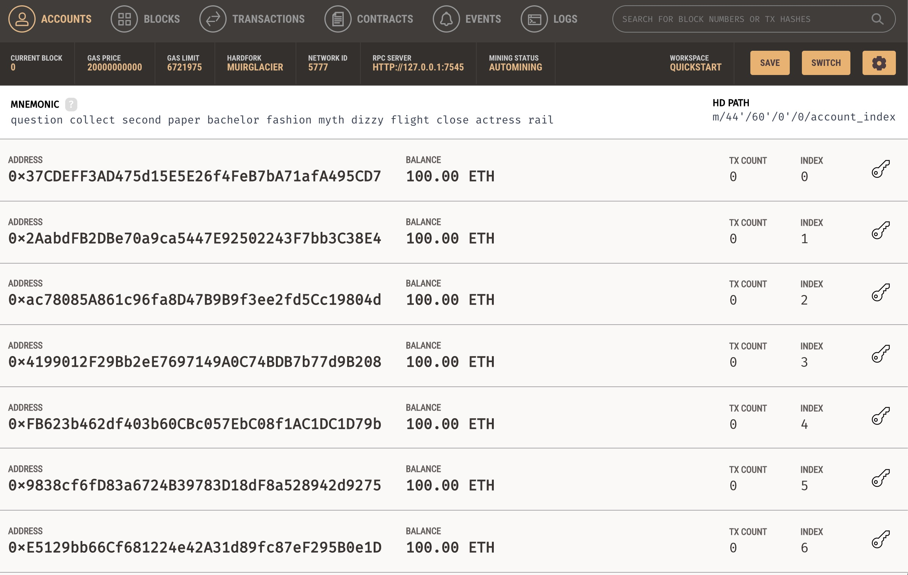
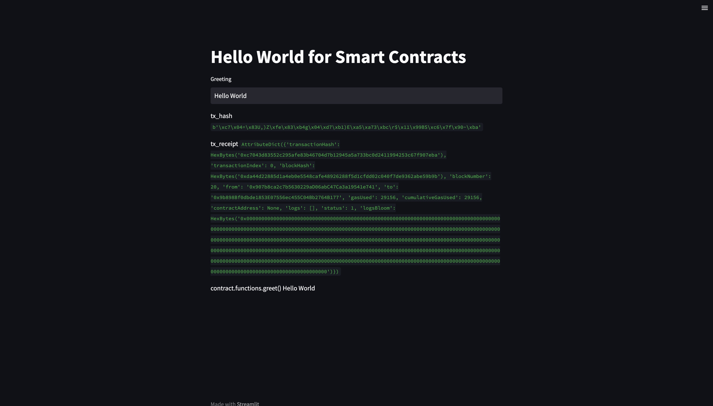
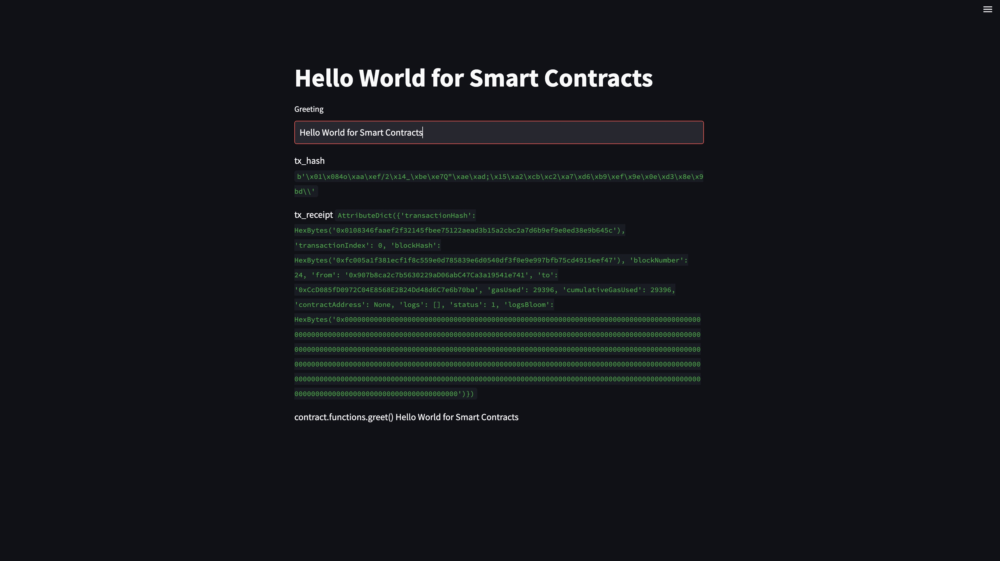
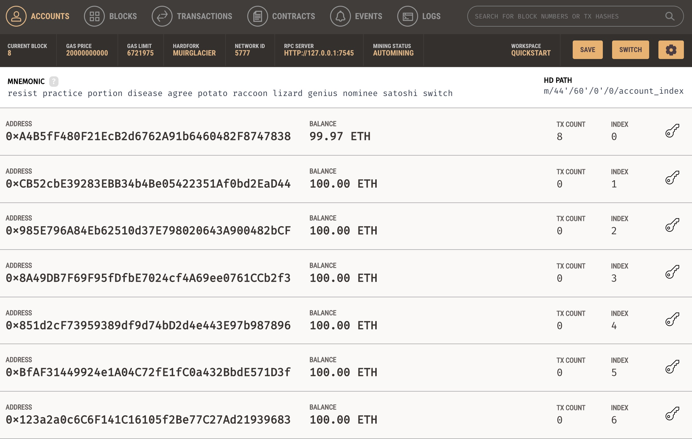
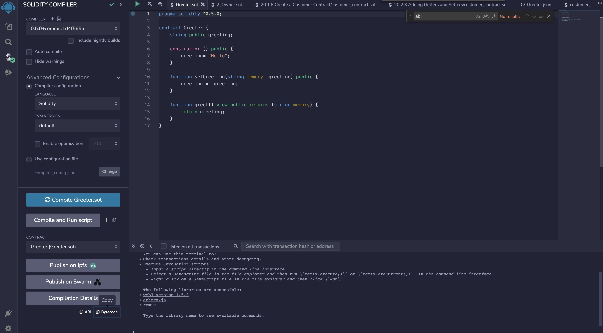

# Hello World for Smart Contracts

## Description

This is a simple "Hello World" streamlit application that shows how to connect a Streamlit application to a "Hello World" smart contract that is deployed on a Ganache private blockchain. We can then further build upon this example to create Streamlit applications that connect to the blockchain and execute smart contracts.
<br/><br/>
You should be able to run the Streamlit application as-is without making changes to the source code. Please see the section "Running the Streamlit Application" for instructions on running the application.
<br/><br/>
One import detail to note is that the smart contract has been compiled already and its `abi` and `bytecode` are included in `streamlit.py`. The smart contract is then deployed as follows:
<br/><br/>

```
# Deploy smart contract
abi = json.loads('[{"constant":false,"inputs":[{"name":"_greeting","type":"string"}],"name":"setGreeting","outputs":[],"payable":false,"stateMutability":"nonpayable","type":"function"},{"constant":true,"inputs":[],"name":"greet","outputs":[{"name":"","type":"string"}],"payable":false,"stateMutability":"view","type":"function"},{"constant":true,"inputs":[],"name":"greeting","outputs":[{"name":"","type":"string"}],"payable":false,"stateMutability":"view","type":"function"},{"inputs":[],"payable":false,"stateMutability":"nonpayable","type":"constructor"}]');
bytecode = '608060405234801561001057...'
Greeter = web3.eth.contract(abi=abi, bytecode=bytecode)
```

<br/><br/>
Please see the section "Deploying the Smart Contract" for more details.
<br/><br/>

## Technologies

This example uses the following technologies:

- **Ethereum** - Ethereum is a decentralized, open-source blockchain with smart contract functionality.
- **Solidity** - Solidity is a statically-typed curly-braces programming language designed for developing smart contracts that run on Ethereum.
- **Remix IDE** - Remix IDE is an open-source, browser based tool that allows developers to create and test smart contracts using Solidity.
- **Ganache** - Ganache allows you to fire up a personal Ethereum blockchain which you can use to run tests, execute commands, and inspect state while controlling how the chain operates.
- **Streamlit**

<br/><br/>

## Installation

You will need to install the following:

- Ganache
- Streamlit

In addition, to install all the required Python libraries, you will need to do execute the following from the command line:

`pip install requirements.txt`

This should install the following dependencies:

```
web3==5.31.1
```

<br/><br/>

## Running the Streamlit Application

To run the application, you need to launch Ganache first. If your Ganache address is different than what is configured in the code, please update the code in `streamlit.py`.
<br/><br/>

<br/><br/>
Once Ganache is launched, then execute the following from the command line:

```
streamlit run streamlit.py
```

This should launch the Streamlit application in the browser.
<br/><br/>
You will then see the following:
<br/><br/>

<br/><br/>
The transaction hash and transaction receipt illustrates that the contract has been called upon initial loading.
<br/><br/>
Now, if you enter in "Hello Smart Contracts" in the text field, this will call the smart contract's `setGreeting()` function and execute the transaction in the Ganache blockchain:
<br/><br/>

<br/><br/>
If you open up Ganache, you can see that the default account has been charged the gas fees for the transaction:
<br/><br/>


<br/><br/>

# Deploying the Smart Contract

**This step is optional and only if you want to make updates to the smart contract and test changes.**
<br/><br/>
Here is the "Hello World" smart contract that we will use in our example:
<br/><br/>

```
pragma solidity ^0.5.0;

contract Greeter {
    string public greeting;

    function Greeter() public {
        greeter = "Hello";
    }

    function setGreeting(string _greeting) public {
        greeting = _greeting;
    }

    function greet() view public returns (string) {
        return greeting;
    }
}
```

<br/><br/>
It contains a getter and setter for the `greeting` attribute.
<br/><br/>
In our example, we compile the smart contract using Remix and then copy the `abi` and `bytecode`. These are necessary for deploying the smart contract using our Python code:
<br/><br/>

<br/><br/>
You will need to copy and paste the `abi` and `bytecode` into your Python code.
<br/><br/>

## Contributors

This sample application was authored by:

Quinn Wong (quinn.wong@gmail.com)
LinkedIn: https://www.linkedin.com/in/quinnwong/

<br/><br/>

## License

The MIT License (MIT)

Copyright (c) 2022 Quinn Wong

Permission is hereby granted, free of charge, to any person obtaining a copy of this software and associated documentation files (the "Software"), to deal in the Software without restriction, including without limitation the rights to use, copy, modify, merge, publish, distribute, sublicense, and/or sell copies of the Software, and to permit persons to whom the Software is furnished to do so, subject to the following conditions:

The above copyright notice and this permission notice shall be included in all copies or substantial portions of the Software.

THE SOFTWARE IS PROVIDED "AS IS", WITHOUT WARRANTY OF ANY KIND, EXPRESS OR IMPLIED, INCLUDING BUT NOT LIMITED TO THE WARRANTIES OF MERCHANTABILITY, FITNESS FOR A PARTICULAR PURPOSE AND NONINFRINGEMENT. IN NO EVENT SHALL THE AUTHORS OR COPYRIGHT HOLDERS BE LIABLE FOR ANY CLAIM, DAMAGES OR OTHER LIABILITY, WHETHER IN AN ACTION OF CONTRACT, TORT OR OTHERWISE, ARISING FROM, OUT OF OR IN CONNECTION WITH THE SOFTWARE OR THE USE OR OTHER DEALINGS IN THE SOFTWARE.
